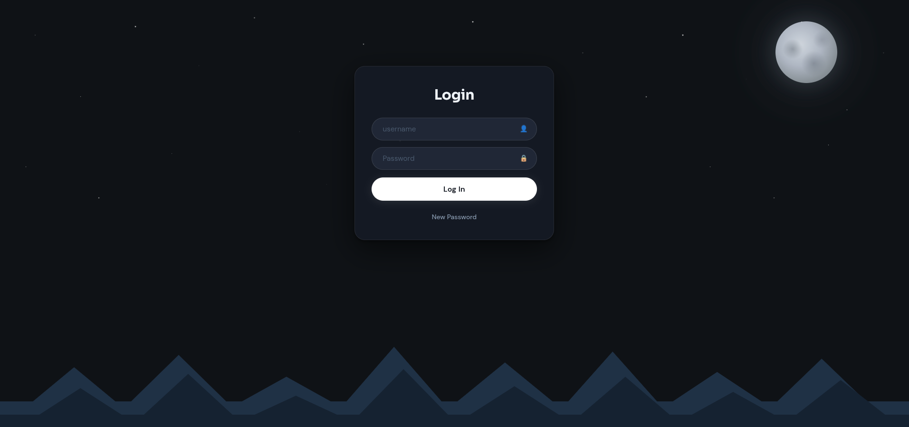
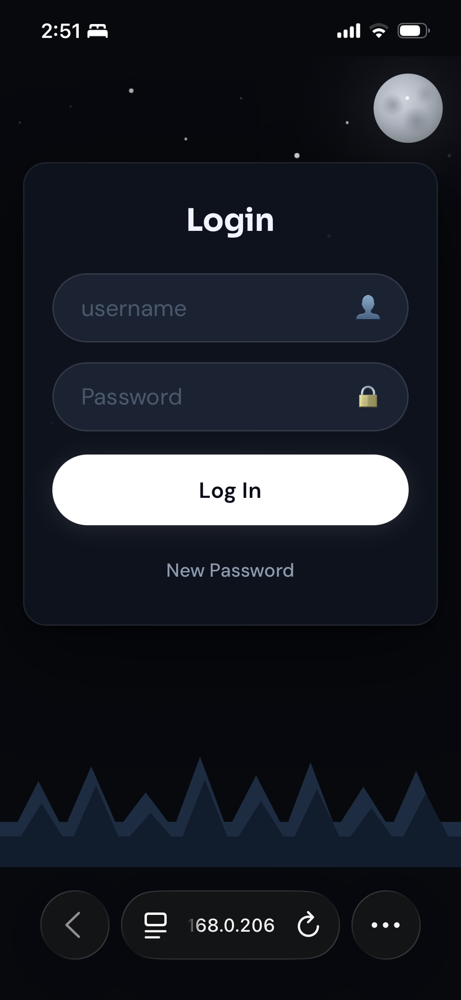
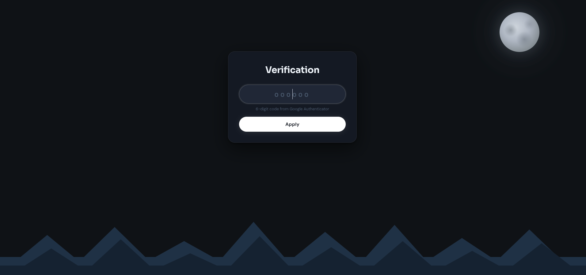
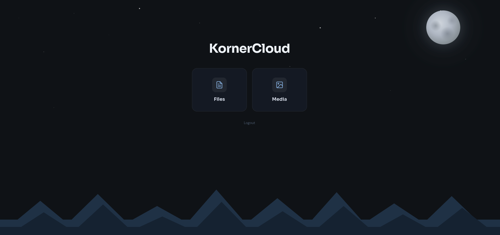
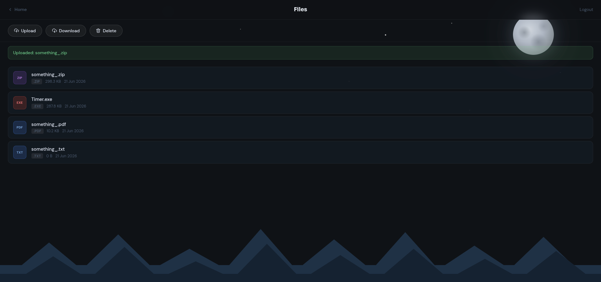
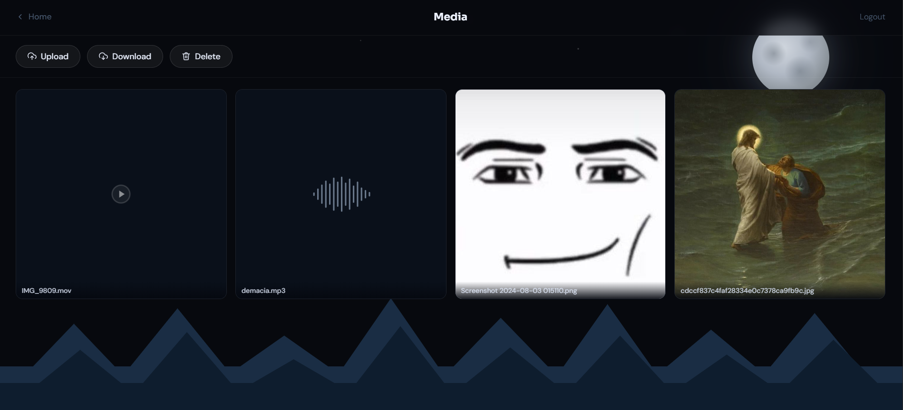
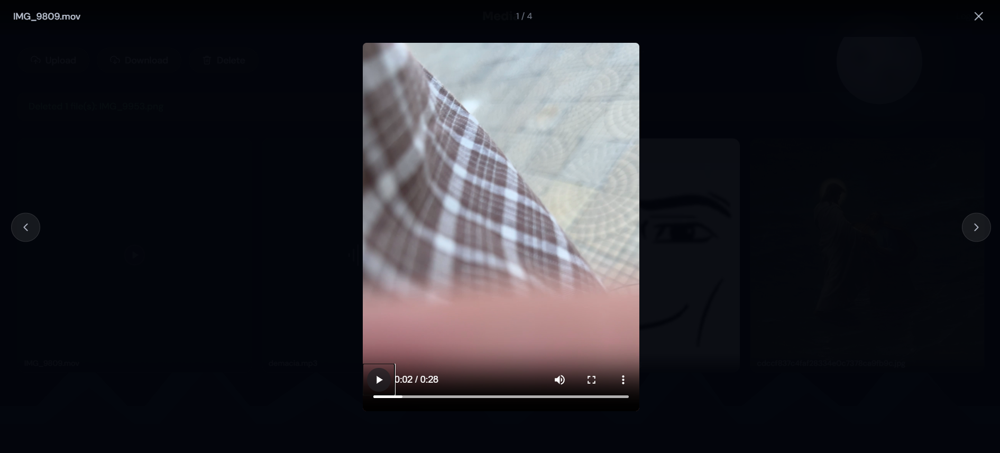
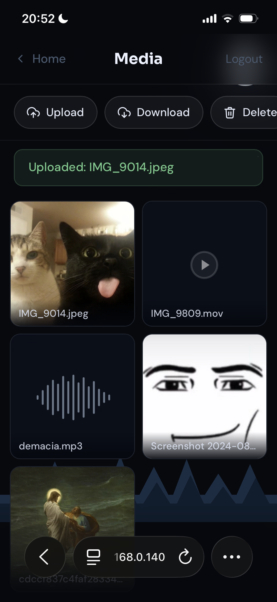
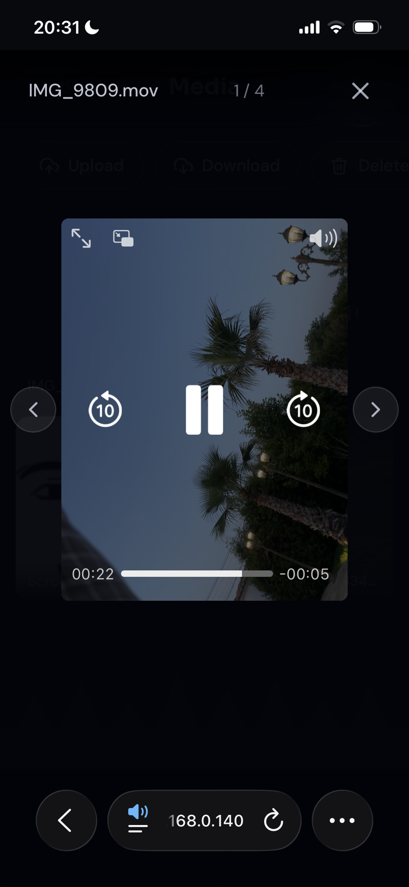

# KornerCloud
 
A self-hosted personal cloud server with secure login, two-factor authentication, and separate spaces for files and media — built with Django, containerized with Docker, and themed like a quiet night sky.
 

 
## Features
 
- **Single secure account** — one user (`YouKnow`), forced to change the default password on first login
  
- **Two-factor authentication** — TOTP via Google Authenticator, with a one-time QR code setup on first use

- **Brute-force protection** — failed login attempts lock out by IP address (`django-axes`)

- **Files and Media, kept separate** — the Files page accepts anything except media types (zip, pdf, docs, executables, etc.); the Media page accepts only images, video, and audio

- **Built for large files**

- **Bulk actions** — multi-select download (bundled as a ZIP) and delete, using a deliberate two-click confirm pattern

- **Media lightbox** — full-size preview with swipe gestures and keyboard navigation

- **Responsive design** — works on desktop and mobile, down to small phone screens

- **One-command setup** — `docker compose up --build` and you're running

## Screenshots
 
| Login | 2FA Setup |
|---|---|
|  |  |
 
| Cloud Home | Files |
|---|---|
|  |  |
 
| Media Grid | Media Lightbox |
|---|---|
|  |  |

| Media Grid (phone) | Media Lightbox (phone) |
|---|---|
|  |  |


<br>

## Getting Started
 
### Prerequisites
 
- **Docker** — Docker Desktop on Windows/Mac, or Docker Engine + Compose v2 on Linux
- **Git** — to clone the repository

That's it. Python is optional to install on your machine, because everything runs inside containers.
### 1. Clone the repository
 
```bash
git clone https://github.com/yourusername/KornerCloud.git
cd KornerCloud
```
<br>

### 2. Configure your environment
 
Copy (rename) the example environment file:
 
```bash
cp core/.env.example core/.env
```
 
Open `core/.env` and generate a `SECRET_KEY`. Run this in your terminal:
 
```bash
python -c "import secrets; print(secrets.token_urlsafe(50))"
```
 
If you don't have Python installed, use Docker instead (Windows users: run this in **cmd**, not PowerShell):
 
```bash
docker run --rm python:3.14-slim python -c "import secrets; print(secrets.token_urlsafe(50))"
```
 
Paste the printed value into `core/.env`, as a `SECRET_KEY`:
 
```dotenv
DEBUG=False
SECRET_KEY=paste-your-generated-key-here
```
<br>

 ### 3. Build and run
 
From the repository root (where `docker-compose.yml` lives):
 
```bash
docker compose up --build
```
 
The first run will build the image, apply database migrations (including creating the default `YouKnow` account), and start the app. You'll see a number of Gunicorn workers boot up — that's normal.
 
Once it's running, open your browser to:
 
```
http://<your-machine-ip>:1212
```
 
On the same machine, `http://localhost:1212` also works.

<br>

### 4. First login
 
KornerCloud ships with one pre-created account:
 
- **Username:** `YouKnow`
- **Password:** `YouKnow12?`
Logging in with the default password triggers a forced password change — you'll be redirected to set a new one immediately. After that, log in again with your new password.
 
Next comes two-factor setup: a QR code appears **once**. Scan it with Google Authenticator (or any TOTP app), then enter the 6-digit code to complete login. From then on, only the 6-digit code is needed — the QR code won't appear again.

<br>

## Using KornerCloud
 
### Files
 
The Files page is for everything that isn't an image, video, or audio file — documents, archives (`.zip`, `.rar`, etc.), executables, anything.
 
- **Upload** — click Upload, select one or more files
- **Download** — click Download, select the file(s) you want, click Download again to confirm. Selecting multiple files downloads them as a single ZIP.
- **Delete** — click Delete, select the file(s), click Delete again to confirm
Clicking Download or Delete a second time with nothing selected cancels the action.

<br>

### Media
 
The Media page works the same way, but only accepts images, video, and audio. Each item shows a thumbnail (or a waveform icon for audio). Clicking any item opens it full-size in a lightbox, where you can navigate with the on-screen arrows, swipe gestures, or your keyboard's arrow keys.

<br>

### Simultaneous Access

- **Multiple devices can use KornerCloud simultaneously** once logged in.
- However, since there is only one account, each device must log in separately — and because the 2FA code rotates *every 30 seconds*, two devices cannot complete the login process at the exact same moment. In practice this is rarely an issue: log in one device, then the other.

<br>

## Remote Access via Tailscale
 
KornerCloud is designed for use on a local network, but if you want to access it from outside your home — for yourself while travelling, or for friends and family — [Tailscale](https://tailscale.com) is the easiest way to do it.
 
Tailscale creates a private network between your devices without any router configuration. Its free Personal plan covers up to six users with unlimited devices, which is enough for most households.
 
1. Install Tailscale on the machine running KornerCloud, and on any device that should access it
2. Log in to the same Tailscale account on each device
3. Find the Tailscale IP of your KornerCloud machine (usually `100.x.x.x`)
4. From any connected device, visit `http://<tailscale-ip>:1212` — it works exactly like being on the same local network

Or you can use WireGuard, which is a bit more technical to set up and manage. It's a great choice if you want to avoid relying on a third-party SaaS management plane.

<br>

## Project Structure
 
```
KornerCloud/
├── Dockerfile
├── docker-compose.yml
├── requirements.txt
├── nginx/
│   └── nginx.conf
└── core/
    ├── manage.py
    ├── gunicorn.conf.py
    ├── .env_example
    ├── templates/        # global templates + custom error pages
    ├── core/              # Django settings, urls, wsgi
    ├── login/             # login, password change, 2FA
    └── cloud/             # Files & Media management
```
 
`data/`, `media/`, and `staticfiles/` are created automatically as Docker volumes and are not part of the repository.

<br>

## Tech Stack
 
- **Backend** — Django 6.0
- **Authentication** — `django-otp` (TOTP / 2FA), `django-axes` (brute-force protection)
- **QR Codes** — `qrcode` + Pillow
- **Database** — SQLite
- **App Server** — Gunicorn (`gthread` workers)
- **Reverse Proxy** — nginx
- **Containerization** — Docker + Docker Compose v2

<br>

## Design Decisions
 
A few choices in this project were made deliberately, and might be worth explaining for anyone reading the code.

<br>
 
**Dynamic default-password detection.** Rather than storing a "must change password" flag in the database, the login view simply checks `user.check_password(settings.DEFAULT_USER_PASSWORD)` after authentication succeeds. If it matches, the user is redirected to set a new password. This keeps the `login` app's `models.py` empty — one less model to maintain, and one less thing that can fall out of sync.
 
**IP-only lockout with django-axes.** `AXES_LOCKOUT_PARAMETERS = ['ip_address']` means failed login attempts are tracked and locked by IP address only. This matters because the username is fixed (`YouKnow`) — without this setting, someone repeatedly guessing the username wrong could lock out the legitimate owner's own account. Locking by IP means only the attacker gets blocked.
 
**SQLite, deliberately.** For a single-user self-hosted app, SQLite avoids the overhead and complexity of running a separate database container. It's stored in a Docker volume so data survives rebuilds.
 
**Synchronous `gthread` workers, not async.** The application is deployed using Gunicorn's synchronous workers rather than ASGI workers. All views are synchronous Django views, and running in a fully synchronous environment avoids compatibility issues with some middleware and authentication components while providing no downside for this project's workload. Gunicorn's `gthread` workers (sync workers with threading) handle concurrent file uploads and downloads cleanly without any of that complexity.

**Files and Media are fully separated.** Two models, two upload directories, and MIME-type validation on every upload — a file with an image/video/audio MIME type is rejected on the Files page, and vice versa on the Media page. This isn't just a UI distinction; the separation exists at the storage and database level too.
 
**Nothing is served directly from `/media/`.** Every download and every media preview goes through an authenticated, 2FA-verified Django view using `FileResponse`. nginx has no access to the media directory at all — only to collected static files (CSS/fonts), which contain nothing sensitive.
 
**Unlimited, streaming file transfers.** nginx is configured with `client_max_body_size 0`, `proxy_request_buffering off`, and `proxy_buffering off`. This means a 50GB upload streams straight through to Django without nginx ever buffering the whole file, and a 50GB download streams straight back to the browser the same way.
 
**`ALLOWED_HOSTS = ['*']` in production.** This looks alarming out of context, but it's safe here specifically because of how the app is built: there are no password-reset emails, no `request.build_absolute_uri()` calls, and nothing that uses the `Host` header to generate links or redirects. Combined with the fact that this app is designed for a private local network or VPN — never direct public exposure — disabling the host check removes a configuration headache (IPs changing between routers) without opening any real attack surface.

<br>
 
## Security Notes & Limitations
 
- KornerCloud is built for a **private local network or VPN** (see Tailscale section above) — it is not designed or hardened for direct exposure to the public internet
- There is **no built-in HTTPS**. Adding it would require every device to trust a local certificate authority, which adds friction for a personal-use tool. If you need encrypted remote access, Tailscale (or another VPN) handles this for you
- This is a **single-user system by design** — there is no multi-account support
- The default password (`YouKnow12?`) **must** be changed on first login — this is enforced automatically and cannot be skipped
